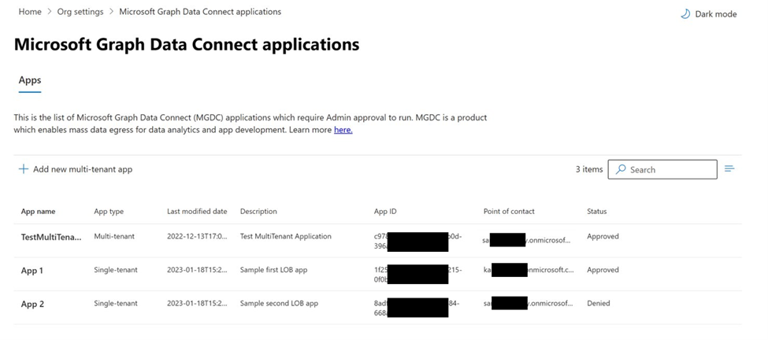
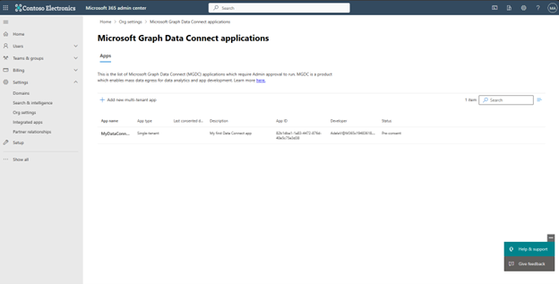
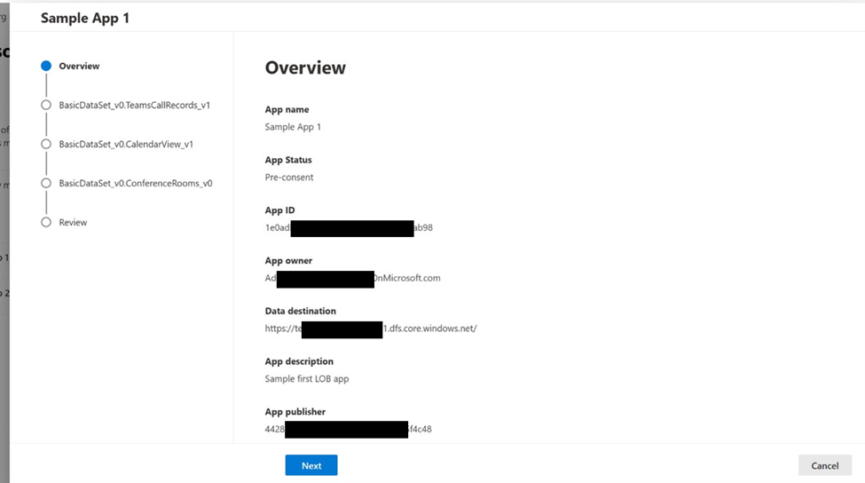
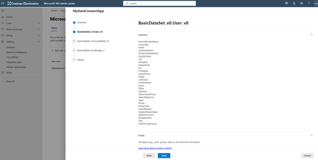
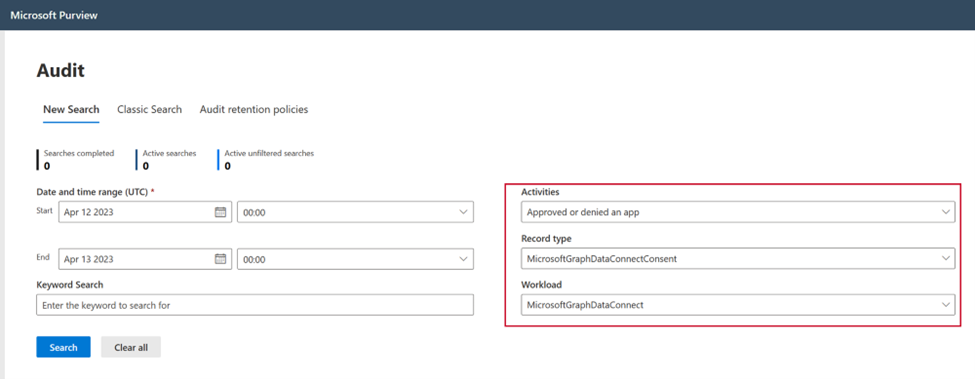

# App authorization

> [!NOTE]
> This documentation is for global administrators authorizing Microsoft Graph Data Connect apps for your organization.

The new Data Connect app authorization experience is built into the M365 admin center. You can get started by navigating to `Org settings` under the `Security & Privacy` tab. For direct access, [click here](https://admin.microsoft.com/Adminportal/Home?#/Settings/MGDCAdminCenter). This is a different entry point from where admins opt-in to Data Connect. Currently, only global administrators may authorize Data Connect applications.

## App summary view

The landing page of the Data Connect applications portal is a quick view of all Data Connect applications you may be interested in, as shown in the images below:

You'll find single-tenant applications and multi-tenant applications in the Data Connect applications portal:

- **Single-tenant applications**—applications that are housed in the your tenant, and require access to data from your tenant. These are typically enterprise scenarios.  
- **Multi-tenant applications**— applications that are housed in another tenant, and require access to data from your tenant. These are typically ISV scenarios. Review the apps carefully, as authorizing them can enable data to be migrated from your tenant to the app developer’s tenant.

All single-tenant apps will be populated in the table by default. Only approved, denied, or expired multi-tenant apps will be included in the table. Other apps may be shown in the table with the following statuses:

- **Pre-authorization**—apps that have not been acted upon yet. This status is only possible for single-tenant apps. Apps in this state will always fail at runtime.
- **Approved**—apps that an admin has approved to access M365 data for your tenant.
- **Denied**—apps that an admin has denied to access M365 data for your tenant. Apps in this state will always fail at runtime.
- **Expired**—apps that an admin has approved to access M365 data for your tenant, but the approval expired. Apps in this state will always fail at runtime.

### App details view

***For this section, can we either have a set of images for the user to click through or a GIF of all wizard pages to reduce number of screenshots***

Clicking on an app entry in the table will launch the app details view, with more information on what data the app requires. This wizard experience walks you through the relevant data access details, and allows you to approve or deny an app at the end. For what this looks like in the Data Connect app portal and M365 admin center, see the images below:

The first step in the wizard shows overview information about the application:

`App owner` main user name of the developer who registered the application.

`Data destination` sink where the data will be delivered. If approved, this app may move the requested data to any location within the listed sink.

`App publisher` Azure AD tenant ID where the app is registered. For single-tenant apps, this should be the same AAD tenant ID as your tenant.

The next few steps vary per dataset. There'll be one step per dataset registered in the app, for example:

`Columns`—specifies columns the app intends to extract via Data Connect. If approved, this app can extract any subset of approved columns for the specified dataset.

`Scope`—specifies scope (i.e., user selection) the app intends to extract via Data Connect. [Learn more about scopes in Data Connect](./data-connect-users-and-groups).

The final wizard step confirms some key information on the app for your to review. You can select `Approve`, `Decline`, or `Cancel`. An action on an app is all or nothing. Authorizing an app means you are authorizing all access specified in the previous steps.

When authorizing an app, you may encounter these error messages:

- App approver and owner cannot be the same user.
- App registration not found. It is possible someone deleted this app.

If an unexpected error occurs, the error message will include an error code. Please note this error code and share with Microsoft support.

### Discovering multi-tenant applications

To discover multi-tenant applications, click on `Add new multi-tenant app` above the app summary table. If your tenant is enabled for cross-tenant data migration, you'll be shown two text boxes. Once you enter the application ID and application’s tenant ID, and click `Find`,the portal will launch the app details view for the app you're searching for.

### M365 audit logs

The fresh Microsoft Graph Data Connect app authorization experience is integrated with M365 audit logs. When admins approve or deny a Data Connect application, an auditable event emits to M365 audit logs along with all relevant data about what exactly was approved or denied. You may search for Data Connect authorization events on audit logs search using any of the following:

`Workload` MicrosoftGraphDataConnect

`Record type` MicrosoftGraphDataConnectConsent

`Activities` Approved or denied an app (Under `Microsoft Graph Data Connect Activities`)

### Authorization validation during pipeline execution

At runtime, Data Connect validates incoming requests against all authorizations in the tenant. If a matching authorization is found, the job will proceed. If no authorization is discovered, the job will fail. Data Connect no longer stalls on `ConsentPending` when awaiting authorization. If authorization validation fails, you'll receive a specific error message on why your job failed to match existing app authorizations.

Authorization validations applied during runtime include:

- The application ID for the incoming request matches an authorized app.
- The found app authorization is approved.
- The application’s tenant ID for the incoming request matches the found app authorization’s app registration tenant ID.
- The dataset for the incoming request is one of the datasets in the found app authorization.
- The columns in the incoming request are a subset of those that were authorized for the requested dataset.
- The destination tenant ID matches the found app authorization’s destination tenant ID.
- The destination location for the incoming request is contained within the destination sink in the found app authorization.
- The scope for the incoming request aligns with the scope in the found app authorization.
  - If the app is authorized for all users/groups in the tenant, then any scope will pass this validation.
  - If the app is authorized for a list of groups, then any subset of the authorized groups will pass this validation.
  - If the app is authorized for a scope filter URI, then the incoming request must exactly match the authorized value.
