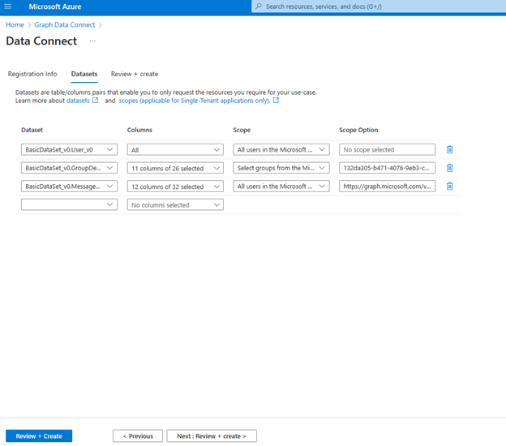
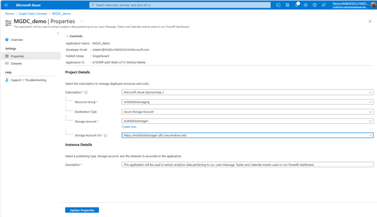
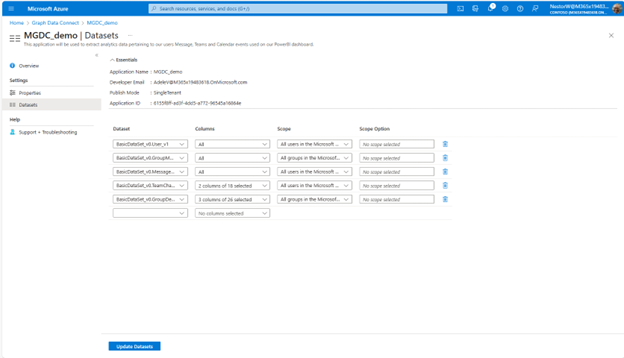
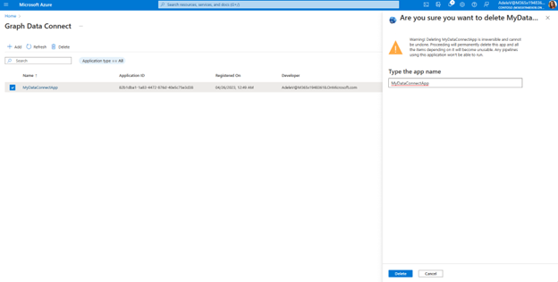

# Microsoft Graph app registration

## Fresh Azure portal experience

This is new best practices guidance for developers using the new Azure portal experience to register an Azure Active Directory (AAD) app with Microsoft Graph Data Connect. Additionally, with the new portal experience, developers and global administrators within the tenant can overview all registered applications, level of detail for authorization, and ability to manage app registrations. Launch your experience in the [Azure portal](aka.ms/mgdcinazure). When you return to the portal, re-launch it in the search bar.

### Landing page

The first screen welcoming you to the new Azure portal experience will show a message asking you to create a new app registration.

> [!IMPORTANT]
> If Data Connect **hasn't been enabled by your admin**, the new portal experience is **disabled**.

After the landing page is populated with registered apps, a table shows details about the apps that were registered, including the following column fields:

1. `Name` the app registration name
2. `App ID` the Azure Active Directory (AAD) application ID
3. `Registered On` the date of registration of the app
4. `Developer` the email address of the developer who registered the application
5. `Multi-tenant` if the app is multi-tenant or single tenant
6. `Last modified` the most recent date when the application was changed

At the top of the table, three buttons are enabled by default: `Add`, `Refresh`, and `Delete`. `Add` starts an action for a new app registration. `Refresh` queries existing app registrations in the tenant again, and refreshes the table. `Delete` is only enabled for single selections, and initiates a deletion process.

## Add a new app registration

When registering a new app with Data Connect, the add wizard will guide you in completing the required details in three tabs: `Registration Info`, `Datasets`, and `Review + create`.

### Registration Info page

The "Registration Info" page outlines standard requirements for app registrations. First, specify the project details, a process that's similar to creating a resource in Azure. The project detail fields are:

`Subscription` (required) select a subscription in the tenant that will be used exclusively to filter the next 4 selections used to configure the destination for the data.

`Resource Group` (required) select the group location for the data storage.
`Destination Type` select the type of storage from Azure Storage Account or Azure SQL Database Server

If the selected type of storage is SQL Database Server, then it will only support Mapping Data Flows types. Learn more about Mapping Data Flows.

`Storage Account` (required) select the storage account where the data to provision with Data Connect will be located, or create a new Azure Storage Account.
`Storage Account Uri` (required) from the storage account selected above, select the Uri to use (Distributed File System (DFS) or blob).

If you select SQL for `Storage Account`, the `Uri` project detail field is disabled.

App registration requires you to select entries for the `Instance Details` that affect default behaviors such as the following fields:

`Application ID` (required) select from the AAD apps in the tenant or create a new one.
`Description` (required) provide details in the text field for app registration: project goal, unique identifier, organization project name, etc.
`Publish Type` (required) select from multi-tenant or single-tenant.
`Key Vault` (required for multi-tenant app registrations) specify the key vault that will enable communication between tenants.

#### Datasets

Once you complete the Registration Info page, specify the datasets that the app registration will need to query. This step is crucial for authorization, as only the datasets selected here will be transferred for administrator authorization. [Learn more about datasets](./data-connect-datasets).

The wizard shows a table that allows the entry of multiple datasets, the selection of columns in the datasets, and further details for authorization of multi-tenant apps (scope and scope options). [Learn more about scopes](./data-connect-filtering#user-selection). You can select each dataset that the app will request for authorization, and all or several columns from the dataset, depending on the level of granularity and privacy required, shown in the images below.

Once completed, click on `Next : Review + create`.

> [!IMPORTANT]
> If there is missing information for the required fields in the previous tabs, the `Next : Review + create` button will not be enabled.

#### Review + create

The last step in the wizard shows a summary page for you to review the specified details and confirm the creation of the app registration entry.

### Overview of app registration process

After your app registration entry is created, you can query its details by clicking on the app name from the landing page. All details specified in creation are shown.

#### Update app registration entry

Access update functionality from the individual app overview page. Only the app owner can update properties or datasets associated with a Data Connect application. As shown in the images below, any updates in the destination storage for the app or the datasets/schema/scopes associated with the app will invalidate any previously provided authorization, requiring the global admin to approve the app again from the M365 admin center.

#### Delete an app registration entry

Delete functionality can be accessed from the individual app overview page, or from the landing page. Currently, only global administrators can delete app registration entries. Proceeding forward, the owner of the Azure Active Directory (Azure AD) app ID will be able to delete the Data Connect app registration as well. If you can delete an app registration entry, then you'll need to type the name of the app to confirm the app's deletion. After the app is deleted, any dependency or pipeline that used it will become unusable, including:

- Any current pipeline utilizing the application and past the authorization validation phase, would continue and succeed.
- Any pipeline before the authorization validation phase would start failing since the application is missing.

Deleting an app registration entry, and confirming your deletion will display in the wizard, shown in the images below.

